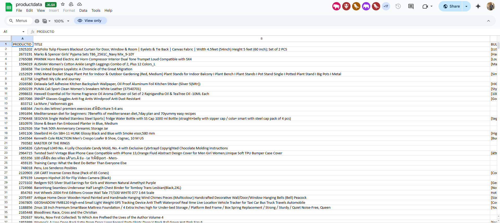
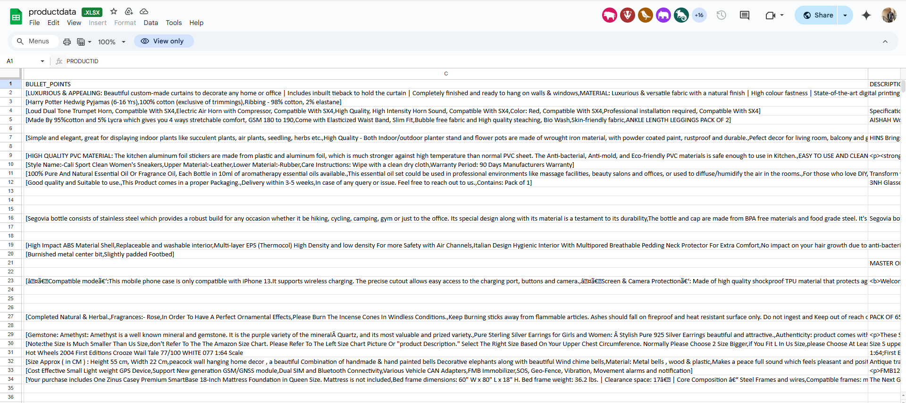
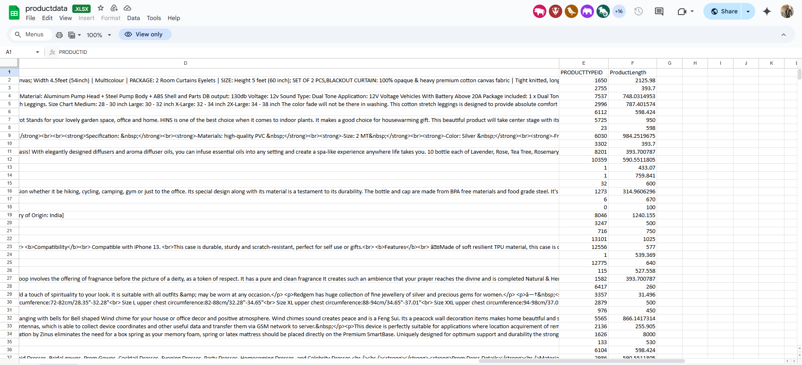
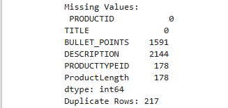
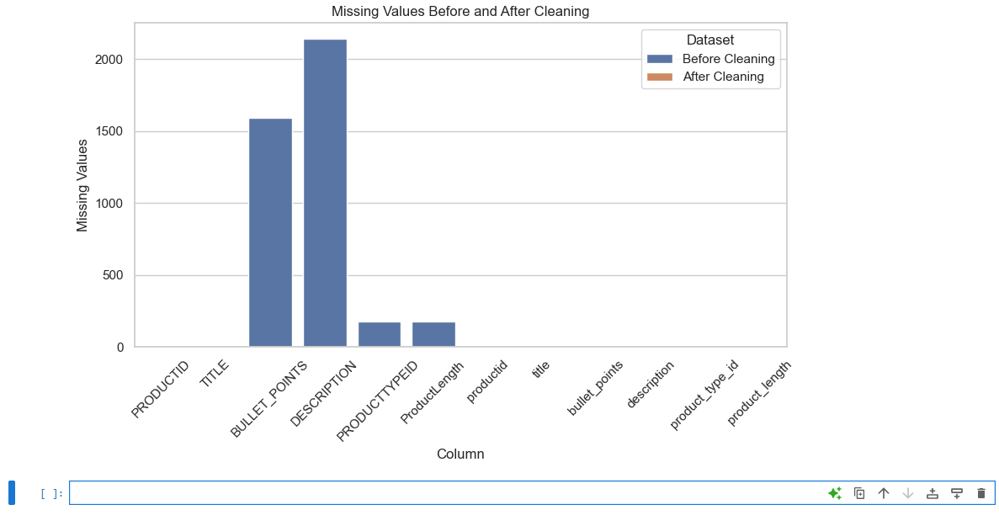
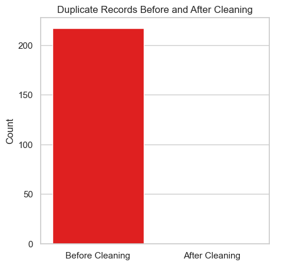
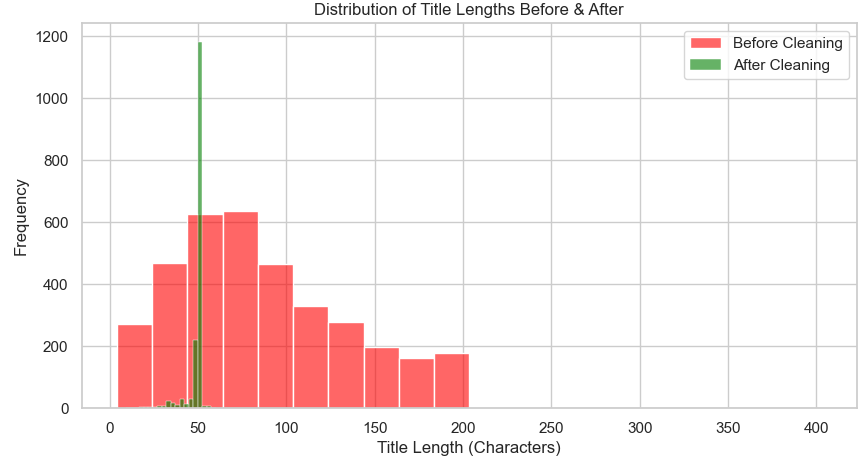

# Data_Cleaning using python

---

---

### Objective
To prepare raw marketing data for analysis by addressing data quality issues and creating a new feature, **_short_title_**, for improved SEO and readability. The task involves resolving data quality issues like missing values and duplicates, standardizing data formats, and generating concise product titles for better marketing impact.

### Task Overview
This task focuses on ensuring the dataset is clean, reliable, and ready for further marketing analysis while introducing a new **_short_title_** feature for SEO-optimized and concise product titles. I will explore, identify, and resolve common data issues using  Python (Pandas, NumPy). Additionally, I'll implement a logic to generate shorter product titles for each entry using the **_(Regular expression library)_**, ensuring they retain key information while being concise and preparing a detailed technical report.

### Data Overview 

Product Dataset:https://docs.google.com/spreadsheets/d/1z3Io4xtC2FMif2lskLbDDcRe5OTjoi4l/edit?gid=822295292#gid=822295292

---

---

---

---

_The dataset consists of 3,847 records and 6 fields, below is a summary of the  Product dataset_

Column names | Data Type
|------------|-------------|
| PRODUCTID  |  Integer, Unique Identifier|
| TITLE      | String, Product Name/Title |
| BULLET_POINTS | String, Product Highlights |
| DESCRIPTION | String, Product Description |
| PRODUCTTYPEID | Float |
| ProductLength |  Float |


**The Data Quality issues were probed**

```
import pandas as pd

df = pd.read_csv("productdata.csv", encoding="ISO-8859-1")

# Check for missing values
print("Missing Values:\n", df.isnull().sum())

# Check for duplicate rows
print("Duplicate Rows:", df.duplicated().sum())
```
* Here are the results
---

---

- Missing Values:
The **.isnull()** function is used to check if there are missing values while the **.sum()** function counts for the True situations and here are the outcomes
PRODUCTID - 0, TITLE - 0, BULLET_POINTS - 1,591, DESCRIPTION - 2,144, PRODUCTTYPEID - 178, ProductLength - 178.

- Duplicates
  A total of 217 Duplicates were recorded after using the .duplicated() function to find duplicate values.


### Data Cleaning ###
- Removing Duplicate Rows:
    Duplicates are removed using **df.drop_duplicates()**, this is in view to ensure unique records.

- Standardizing  Column names:
   There was a need to convert the column names to lower cases which is an ideal practice in any programming language which will help improve uniformity and compatibility with tools and libraries. Furthermore, Spaces in column names are replaced with underscores (_) and specific column names like **(producttypeid & productlength)** are renamed for readability.

- Handle Missing Values:
   Missing values in text columns (bullet_points, description) are replaced with "No Bulletpoint" and “No Description”  respectively using the *.fillna()* function  to ensure consistency and to provide clarity.   
 Missing values in numerical columns (product_type_id, product_length) are replaced with 0        to ensure that missing values are easily identifiable and they do not have any influence over numerical calculations during analysis, although this can be appropriately handled during that analysis stage.


```
import pandas as pd
df = pd.read_csv('productdata.csv')

# Removing duplicate rows
df_cleaned = df.drop_duplicates()

# Converting column names to lowercases
df_cleaned.columns = df_cleaned.columns.str.lower().str.replace(" ", "_")

# Rename 'producttypeid' & 'productlength' to make more meaning
df_cleaned.rename(columns={
    'producttypeid': 'product_type_id',
    'productlength': 'product_length'
}, inplace=True)

# Handle missing values
# Replace missing text columns ('bullet_points', 'description') with specific strings
df_cleaned['bullet_points'].fillna("No Bulletpoint", inplace=True)
df_cleaned['description'].fillna("No Description", inplace=True)

# Replace missing numerical columns ('product_type_id', 'product_length') with 0
df_cleaned['product_type_id'].fillna(0, inplace=True)
df_cleaned['product_length'].fillna(0, inplace=True)

# Count of missing values after cleaning
print("Missing Values After Cleaning:\n", df_cleaned.isnull().sum())

# Counts of duplicate rows after cleaning
print("Duplicate Rows After Cleaning:", df_cleaned.duplicated().sum())

print(df_cleaned.head())

```

### Short Title Feature

  The short title feature will remove redundant words while keeping the essential keywords to retain a meaningful title.
- Removing redundant words:
Using regular expression **(re.sub)** to remove specific words or phrases such as  (includes, set of, features, for, with, &, and) from the title, The \b ensures that only whole words are matched (e.g., "for" in "for sale" is removed, but "for" in "formal" is not), the lastly, The **flags=re.IGNORECASE** makes the search case-insensitive.

- Removing Extra Spaces:
This is in view to remove any extra/double spaces present in the title and the **.strip()** function is used to remove trailing and leading spaces 

- Reducing Title length:
In this project, The title is limited to 50 characters using slicing **([:60])** and ensuring there are no retainment of spaces using **.strip()**.

Then this function is applied to the title column to generate a new column **(short_title)** with a new shortened readable title in place.

```
import re

def generate_short_title(title):
    """
    Generate a concise version of the product title.
    - Removes unnecessary words like 'includes', 'set of', 'features'.
    - Keeps key details within 30-50 characters.
    """
    # Removing redundant words
    title = re.sub(r'\b(includes|set of|features|for|with|&|and)\b', '', title, flags=re.IGNORECASE)

    # Removing extra spaces
    title = re.sub(r'\s+', ' ', title).strip()

    # Limiting to 60 characters while keeping meaningful words
    return title[:60].strip()

# Apply function to create 'short_title'
df_cleaned["short_title"] = df_cleaned["title"].apply(generate_short_title)

print(df_cleaned[["title", "short_title"]].head())
```

Cleaned Datasets:https://docs.google.com/spreadsheets/d/18sFWMoNIbwPB7GX63SSEGV_Qh8Mubj5920mHF3ejhmw/edit?gid=1252314492#gid=1252314492

### Clean Dataset Overview
- Data Completeness: The Data appears to be more complete than the former because some missing values were populated with alternatives e.g The Bulletpoint and  Description columns 

- Readability: The short_title column enables readability which will help in understanding the data faster 

- Column Standardization


Comparisons between the Cleaned and Dirty Dataset
- Missing values before and after cleaning 


```
import pandas as pd
import matplotlib.pyplot as plt
import seaborn as sns


dirty_df= pd.read_csv('productdata.csv')
clean_df = pd.read_csv('clean_product_data.csv')

# Check for missing values
dirty_missing = dirty_df.isnull().sum()
clean_missing = clean_df.isnull().sum()

# Check duplicate records
dirty_duplicates = dirty_df.duplicated().sum()
clean_duplicates = clean_df.duplicated().sum()

# Set plot style
sns.set_theme(style="whitegrid")

# Plot missing values before and after cleaning
missing_values = pd.DataFrame({
    "Dataset": ["Before Cleaning"] * len(dirty_missing) + ["After Cleaning"] * len(clean_missing),
    "Column": list(dirty_missing.index) + list(clean_missing.index),
    "Missing Values": list(dirty_missing.values) + list(clean_missing.values)
})

plt.figure(figsize=(10, 5))
sns.barplot(data=missing_values, x="Column", y="Missing Values", hue="Dataset")
plt.title("Missing Values Before and After Cleaning")
plt.xticks(rotation=45)
plt.show()


# Plot duplicate records before and after cleaning
plt.figure(figsize=(5, 5))
sns.barplot(x=["Before Cleaning", "After Cleaning"], y=[dirty_duplicates, clean_duplicates], palette=["red", "green"])
plt.title("Duplicate Records Before and After Cleaning")
plt.ylabel("Count")
plt.show()
```

The chart below shows a significant drop in missing values across all columns after cleaning.

---

---

- Duplicate records before and after cleaning
  
```

# Plot duplicate records before and after cleaning
plt.figure(figsize=(5, 5))
sns.barplot(
    x=["Before Cleaning", "After Cleaning"], 
    y=[dirty_duplicates, clean_duplicates], 
    hue=["Before Cleaning", "After Cleaning"],  # Assigning hue
    palette=["red", "green"],
    legend=False  # Disable legend since x-axis already describes categories
)
plt.title("Duplicate Records Before and After Cleaning")
plt.ylabel("Count")
plt.show()
```

The chart highlights the elimination of 217 duplicate records, ensuring cleaner data.

---

---


- Distribution of title length before and after cleaning
  
```
df_original["title_length"] = df_original["title"].apply(len)
df_cleaned["title_length"] = df_cleaned["short_title"].apply(len)

plt.figure(figsize=(10,5))
sns.histplot(df_original["title_length"], bins=20, color="red", alpha=0.6, label="Before Cleaning")
sns.histplot(df_cleaned["title_length"], bins=20, color="green", alpha=0.6, label="After Cleaning")
plt.title("Distribution of Title Lengths Before & After")
plt.xlabel("Title Length (Characters)")
plt.ylabel("Frequency")
plt.legend()
plt.show()
```


The chart shows the distribution of the title length compared to the short_title column which can be considered as after cleaning.

---

---


